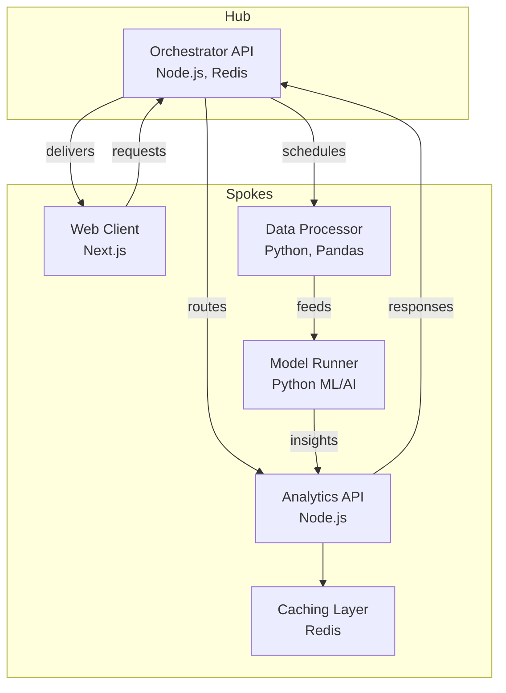

# Sokn Trading Platform (STP)

A modern, high-performance, orchestrated trading system architecture using a hub-and-spoke pattern, designed with Sokn Engineering's expectations in mind.

---

## 📐 Architecture Diagram



## 🧱 Monorepo Structure

```sh
neuralspoke/
├── apps/
│   ├── orchestrator/        # Node.js + Redis (hub)
│   ├── ui-gateway/          # Next.js (spoke)
│   ├── data-processor/      # Python with Pandas (spoke)
│   ├── model-runner/        # Python ML/AI (spoke)
│   └── analytics-api/       # Node.js REST API (spoke)
├── libs/
│   ├── shared-types/        # Shared TypeScript/Python interfaces
├── .github/
│   └── workflows/           # CI/CD pipelines
├── docker-compose.yml       # Service orchestration
├── README.md                # Main project doc (this file)
└── package.json             # Root config for JavaScript packages
```

## 📦 Technologies Used

* **Frontend**: Next.js, React, TailwindCSS
* **Backend**: Node.js, Express, Redis, REST
* **Data/ML**: Python, Pandas, Numpy, Scikit-learn
* **Architecture**: Hub-and-Spoke, Domain-Driven Design
* **Infra**: Docker, Kubernetes-ready, Redis, PostgreSQL, Redis

## 📘 Repo Guide

Each directory in `apps/` includes its own `README.md` explaining its purpose and setup.

---

### ➕ Getting Started

```bash
git clone https://github.com/your-org/neuralspoke.git
cd neuralspoke
docker-compose up --build
```

Visit [http://localhost:3000](http://localhost:3000) to access the UI Gateway.

---

### 🧪 Testing

Each app includes its own test suite. From any app directory:

```bash
npm test
# or
pytest
```

---

### 🚀 Deployment

CI/CD pipelines for GitHub Actions are configured in `.github/workflows/`. The stack is designed for containerized environments like AWS ECS, GCP, or Kubernetes.

---

Ready to disrupt finance with AI-driven algorithmic trading.

---

© 2025 Kristohper Toole
